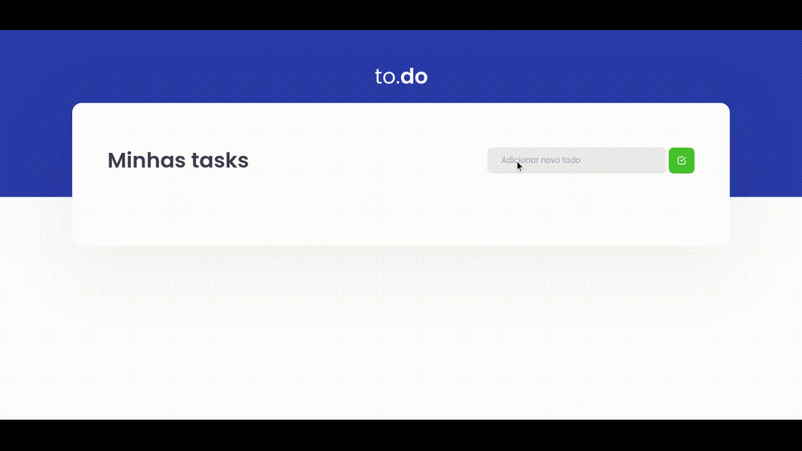

<h1 align="center">
  To Do App
</h1>

<p align="center">
  Aplicativo simples de lista tarefas feito com <a href="https://pt-br.reactjs.org/">React</a> e  <a href="https://www.typescriptlang.org/">Typescript</a>  
</p>

<p align="center">
<a href="#sobre">Sobre</a> •
 <a href="#pre-requisitos">Pré-requisitos</a> •
 <a href="#tecnologias">Tecnologias</a> • 
 <a href="#autor">Autor</a> •
 <a href="#licenca">Licença</a> • 
</p>

<h4 align="center">
  ✅ To Do App 🚀 Finalizado ✅
</h4>

<h2 align="center">
  
</h2>

---

<h2 id="sobre">💻️ Sobre o Projeto</h2>
Essa é uma aplicação básica de lista de tarefas criada como desafio da trilha de ReactJS do curso Ignite da <a href="https://www.rocketseat.com.br/">Rocketseat</a>

### ⚙️ Funcionalidades:
* Adicionar novas tarefas
* Marcar/Desmacar tarefa como concluída
* Remover uma tarefa

---

<h2 id="pre-requisitos">Pré-requisitos</h2>

Antes de começar, você vai precisar ter instalado em sua máquina as seguintes ferramentas:
[Git](https://git-scm.com), [Node.js](https://nodejs.org/en/). 
Além disto é bom ter um editor para trabalhar com o código como [VSCode](https://code.visualstudio.com/)

### Iniciando a aplicação

```bash
# Clone este repositório
$ git clone <https://github.com/jose-uilton-ferreira/desafio01-trilha-reactjs>

# Acesse a pasta do projeto no terminal/cmd
$ cd desafio01-trilha-reactjs

# Instale as dependências
$ npm install

# Execute a aplicação em modo de desenvolvimento
$ npm run server

# O servidor inciará na porta:8080 - acesse <http://localhost:8080>
```

### Executando testes

```bash
# Execute o comando abaixo
npm run test
```
---

<h2 id="tecnologias">🛠 Tecnologias</h2>

As seguintes ferramentas foram usadas na construção do projeto:

- [Node.js](https://nodejs.org/en/)
- [React](https://pt-br.reactjs.org/)
- [TypeScript](https://www.typescriptlang.org/)

---

<h2 id="autor">Autor</h2>

<a href="https://www.linkedin.com/in/jos%C3%A9-uilton-ferreira-de-siqueira-399158198/">
 
 <br />
 <sub><b>José Uilton</b></sub></a>


Feito com ❤️José Uilton 👋🏽 Entre em contato!

[](https://twitter.com/UiltonSiqueira) [](https://www.linkedin.com/in/jos%C3%A9-uilton-ferreira-de-siqueira-399158198/) 
[](mailto:programasuilton@gmail.com)

---

<h2 id="licenca">📃 Licença</h2>
Este projeto esta sobe a licença <a href="https://github.com/jose-uilton-ferreira/desafio01-trilha-reactjs/blob/main/LICENSE">MIT</a>